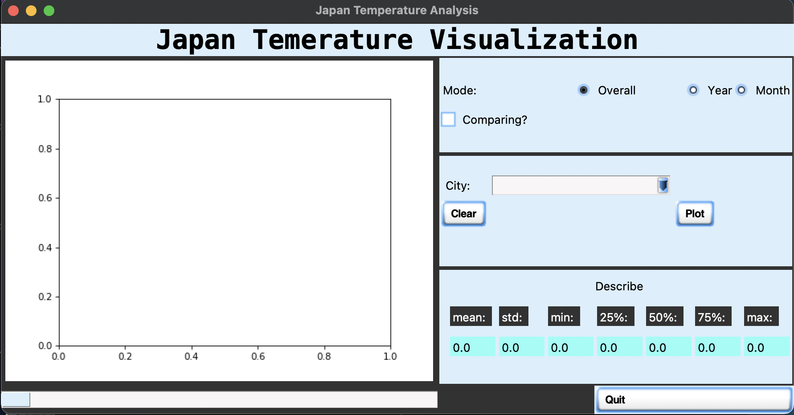
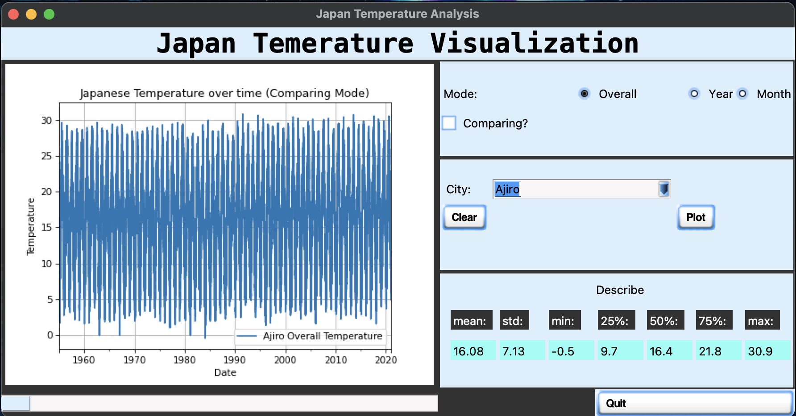
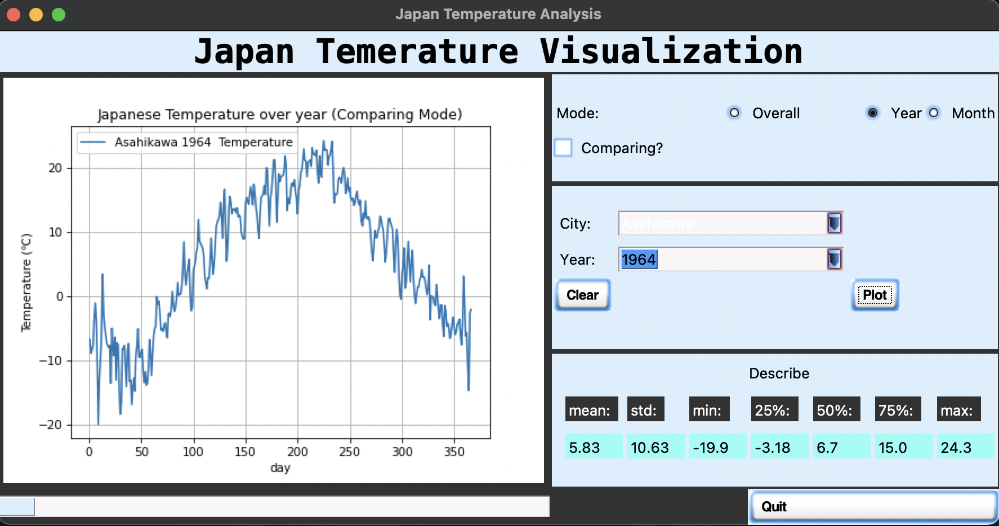
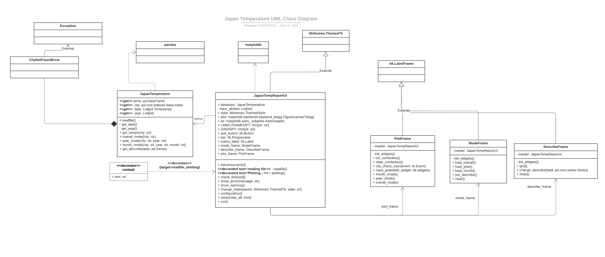
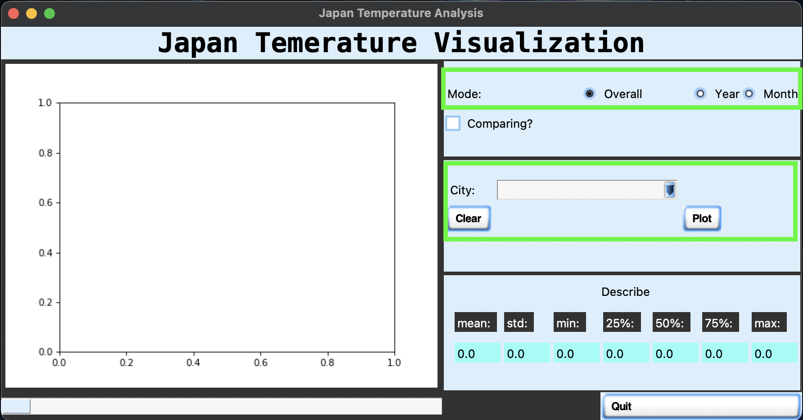

# Japan City temperature Visualization

This Program was develop for 01219116 Programming II
Second Semester, 2021. Section 450 

## Description

My application can illustrate all Japan city temperature between `1/1/1955` to `1/1/2021` day by day in average of day by day format

user can choose whether to illustrate the line graph of temperature that

- Overall of each specific city Tempearture
- Tempearture in each specific city in specfic year
- Tempearture in each specific city in specfic year and month

and user can also choose whether to compare or not of all 3 option above  

when **initialize** the program it will set to not `comparing overall mode` to default and it will look like this
 the bottom bar is the Progress bar that illustrate what going on the program

this is **Example of plotting of Three mode** that have mentioned before

1. **Overall mode**


1. **Year Mode**


1. **Month Mode**


Example of **comparing mode** will look like this


**The Demonstative VDO of this Program is [here](https://youtu.be/m3bdEVEcciA)**

## Running the Application

You must ***use*** **`Python 3++`** to run this application.

Requirements for this program are:

- [Numpy](https://pypi.org/project/numpy/)
- [Pandas](https://pypi.org/project/pandas/)
- [ttkthemes](https://pypi.org/project/ttkthemes/)

to install all the above packages you can use the following command in `termainal/shell`:

```sh
pip install -r requirements.txt
```

## Design

My Uml Class Diagram is [here](Uml_class_diagram.png) or look down below pics  


I think that this program has to have `backend` and `fromtend(UI)` then I seperate UI to partial class eg, `ModeFrame`, `DescibeFrame`, and `PlotFrame` and the main class(root class) and using database in backend in frontend this called `Independency injection` Design.

My Program has **5 main class** including

1. `JapanTemperature`  
model(database that will be use in UI) it can reading database from `csv` file and store it in `DataFrame` format. and calculated it then sent it back to UI to illustrated.

1. `JapanTempReportUI`
UI(frontend) it can show the UI and interact with user. and it also master class of overall UI that including below class

1. `ModeFrame`
user can selecing which mode will select in this frame

1. `DescribeFrame`
This frame illustrate the description including, all **3 quatile**, **mean**, **min**, **max** and **standard deviation** of all 3 mode up to which mode user is selected

1. `PlotFrame`
This frame containing  list to choose **city**, **year**, and **month** **clear button** and **plot button** and it will plot the graph of **overall**, **year**, and **month** mode.

## Design Patterns Used

In this Project 5 Design Patterns are used including:

1. **Observer Pattern**  
binding some function to the event of the program eg. binding `combobox`, `button`, and other.

1. **Decorator Pattern**  
In `JapanTempUI.py` it have one decorator  name `run_task`, I use it to minimize the code of progress bar and to be wrapper of running task instead of call function by `run_task(func)` I can call `func()` directly.

1. **Dependency Injection Pattern**  
I'be call the JapanTemp in backend that use in the frontend. In other word, It is `database` attribute in `JapanTempReportUI` class.

1. **Composite Pattern**  
I use use lots of frame to be container of all the ttkwidgets then use parent to be container of all the frame.

## Bug

This Program has a bugs that I trying to fix it but can't fix it that is **Griding bug** its make the program is look not so beauty as I want it to look as picture below.


it also has **text in combobox not shown** when Running in `MacOS` Darkmode as seen as picture above too!
